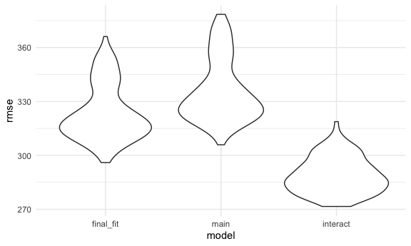

Linear models
================

### Problem 1

Loading data

``` r
homicide_df = 
  read_csv("data/homicide-data.csv", na = c("", "NA", "Unknown")) %>% 
  mutate(
    city_state = str_c(city, state, sep = ", "),
    victim_age = as.numeric(victim_age),
    resolution = case_when(
      disposition == "Closed without arrest" ~ 0,
      disposition == "Open/No arrest"        ~ 0,
      disposition == "Closed by arrest"      ~ 1)
  ) %>% 
  filter(
    victim_race %in% c("White", "Black"),
    city_state != "Tulsa, AL") %>% 
  select(city_state, resolution, victim_age, victim_race, victim_sex)
```

    ## 
    ## ── Column specification ────────────────────────────────────────────────────────
    ## cols(
    ##   uid = col_character(),
    ##   reported_date = col_double(),
    ##   victim_last = col_character(),
    ##   victim_first = col_character(),
    ##   victim_race = col_character(),
    ##   victim_age = col_double(),
    ##   victim_sex = col_character(),
    ##   city = col_character(),
    ##   state = col_character(),
    ##   lat = col_double(),
    ##   lon = col_double(),
    ##   disposition = col_character()
    ## )

Start with one city.

``` r
baltimore_df=
  homicide_df %>% 
  filter(city_state=="Baltimore, MD")

glm(resolution~victim_age+ victim_race + victim_sex, 
    data=baltimore_df,
    family=binomial()) %>% 
  broom::tidy() %>% 
  mutate(
    OR= exp(estimate),
    CI_lower=exp(estimate-1.96 * std.error),
    CI_upper=exp(estimate+1.96 * std.error)
  ) %>% 
  select(term, OR, starts_with("CI")) %>% 
  knitr::kable(digits=3)
```

| term              |    OR | CI\_lower | CI\_upper |
| :---------------- | ----: | --------: | --------: |
| (Intercept)       | 1.363 |     0.975 |     1.907 |
| victim\_age       | 0.993 |     0.987 |     1.000 |
| victim\_raceWhite | 2.320 |     1.648 |     3.268 |
| victim\_sexMale   | 0.426 |     0.325 |     0.558 |

Try across cities.

``` r
models_results_df = 
  homicide_df %>% 
  nest(data = -city_state) %>% 
  mutate(
    models = 
      map(.x = data, ~glm(resolution ~ victim_age + victim_race + victim_sex, data = .x, family = binomial())),
    results = map(models, broom::tidy)
  ) %>% 
  select(city_state, results) %>% 
  unnest(results) %>% 
  mutate(
    OR = exp(estimate),
    CI_lower = exp(estimate - 1.96 * std.error),
    CI_upper = exp(estimate + 1.96 * std.error)
  ) %>% 
  select(city_state, term, OR, starts_with("CI")) 
```

Male vs Female Homicide Resolutions

``` r
models_results_df %>% 
  filter(term=="victim_sexMale") %>% 
mutate(city_state=fct_reorder(city_state, OR)) %>% 
  ggplot(aes(x=city_state, y=OR))+
  geom_point()+
  geom_errorbar(aes(ymin=CI_lower, ymax=CI_upper))+
  theme(axis.text.x= element_text (angle=90, vjust=0.5, hjust=1))
```


### Problem 2

Load and clean the data for regression analysis (i.e. convert numeric to
factor where appropriate, check for missing data, etc.).

``` r
birth_weight_df = 
  read_csv("./data/birthweight.csv") %>%   
janitor::clean_names() %>% 
  mutate(
   frace = as.factor(frace),
   frace = recode(frace,
    "1" = "White", 
    "2" = "Black", 
    "3" = "Asian", 
    "4" = "Puerto Rican", 
    "8" = "Other", 
    "9" = "Unknown"),
   mrace = as.factor(mrace),
   mrace = recode(mrace, 
    "1" = "White", 
    "2" = "Black", 
    "3" = "Asian", 
    "4" = "Puerto Rican", 
    "8" = "Other"),
   babysex = as.factor(babysex),
   babysex = recode(babysex, 
     "1" = "male", 
    "2" = "female"),
   malform = as.factor(malform),
   malform = recode(malform,
    "0" = "absent", 
    "1" = "present")) %>% 
  filter(
    frace %in% c("White", "Black", "Puerto Rican")
  )
```

    ## 
    ## ── Column specification ────────────────────────────────────────────────────────
    ## cols(
    ##   .default = col_double()
    ## )
    ## ℹ Use `spec()` for the full column specifications.

I propose that `blength`, `delwt`, `bhead`,`parity`, `mrace`, `fincome`,
`smoken`, and `pnumlbw` would be in the model. I chose baby’s length at
birth, baby’s head circumference, mother’s weight at delivery, mother’s
number of live births before this pregnancy,average number of cigarettes
smoked per day during pregnancy,and previous number of low birth weight
babies since these variables are relevant to gestational and newborn
development. I chose race and family monthly income since they are
socioeconomic factors that could impact baby’s birthweight.

``` r
birth_weight_df %>% 
  mutate(
    mrace=fct_infreq(mrace)
  )
```

    ## # A tibble: 4,282 x 20
    ##    babysex bhead blength   bwt delwt fincome frace gaweeks malform menarche
    ##    <fct>   <dbl>   <dbl> <dbl> <dbl>   <dbl> <fct>   <dbl> <fct>      <dbl>
    ##  1 female     34      51  3629   177      35 White    39.9 absent        13
    ##  2 male       34      48  3062   156      65 Black    25.9 absent        14
    ##  3 female     36      50  3345   148      85 White    39.9 absent        12
    ##  4 male       34      52  3062   157      55 White    40   absent        14
    ##  5 female     34      52  3374   156       5 White    41.6 absent        13
    ##  6 male       33      52  3374   129      55 White    40.7 absent        12
    ##  7 female     33      46  2523   126      96 Black    40.3 absent        14
    ##  8 female     33      49  2778   140       5 White    37.4 absent        12
    ##  9 male       36      52  3515   146      85 White    40.3 absent        11
    ## 10 male       33      50  3459   169      75 Black    40.7 absent        12
    ## # … with 4,272 more rows, and 10 more variables: mheight <dbl>, momage <dbl>,
    ## #   mrace <fct>, parity <dbl>, pnumlbw <dbl>, pnumsga <dbl>, ppbmi <dbl>,
    ## #   ppwt <dbl>, smoken <dbl>, wtgain <dbl>

Baby’s Length

``` r
length_fit = lm(bwt ~ blength, data = birth_weight_df)
length_fit %>% 
  broom::tidy() %>% 
  select(term, estimate, p.value) %>% 
  knitr::kable(digits=3)
```

| term        |   estimate | p.value |
| :---------- | ---------: | ------: |
| (Intercept) | \-3843.499 |       0 |
| blength     |    139.851 |       0 |

Baby’s Head Circumference

``` r
head_fit = lm(bwt ~ bhead, data = birth_weight_df)
head_fit %>% 
  broom::tidy() %>% 
  select(term, estimate, p.value) %>% 
  knitr::kable(digits=3)
```

| term        |   estimate | p.value |
| :---------- | ---------: | ------: |
| (Intercept) | \-4850.920 |       0 |
| bhead       |    236.706 |       0 |

Mother’s Weight at Delivery

``` r
dlw_fit = lm(bwt ~ delwt, data = birth_weight_df)
dlw_fit %>% 
  broom::tidy() %>% 
  select(term, estimate, p.value) %>% 
  knitr::kable(digits=3)
```

| term        | estimate | p.value |
| :---------- | -------: | ------: |
| (Intercept) | 2136.607 |       0 |
| delwt       |    6.704 |       0 |

Mother’s Number of Live Births Before Pregnancy

``` r
parity_fit = lm(bwt ~ parity, data = birth_weight_df)
parity_fit %>% 
  broom::tidy() %>% 
  select(term, estimate, p.value) %>% 
  knitr::kable(digits=3)
```

| term        | estimate | p.value |
| :---------- | -------: | ------: |
| (Intercept) | 3113.809 |   0.000 |
| parity      | \-41.524 |   0.584 |

Average Number of Cigarettes Smoked per Day

``` r
smoke_fit = lm(bwt ~ smoken, data = birth_weight_df)
smoke_fit %>% 
  broom::tidy() %>% 
  select(term, estimate, p.value) %>% 
  knitr::kable(digits=3)
```

| term        | estimate | p.value |
| :---------- | -------: | ------: |
| (Intercept) | 3135.726 |       0 |
| smoken      |  \-5.284 |       0 |

Previous Number of Low Births Before Pregnancy

``` r
pnumlbw_fit = lm(bwt ~ pnumlbw, data = birth_weight_df)
head_fit %>% 
  broom::tidy() %>% 
  select(term, estimate, p.value) %>% 
  knitr::kable(digits=3)
```

| term        |   estimate | p.value |
| :---------- | ---------: | ------: |
| (Intercept) | \-4850.920 |       0 |
| bhead       |    236.706 |       0 |

Out of all of these linear models, the only non-significant one was
Mother’s Number of Live Births Before Pregnancy so I made a new model
with the significant variables so far.

``` r
together_fit=lm(bwt ~ bhead+ blength+ delwt + smoken, data=birth_weight_df) 

together_fit %>% 
  broom::tidy() %>% 
  select(term, estimate, p.value) %>% 
  knitr::kable(digits=3)
```

| term        |   estimate | p.value |
| :---------- | ---------: | ------: |
| (Intercept) | \-6073.857 |   0.000 |
| bhead       |    142.961 |   0.000 |
| blength     |     81.849 |   0.000 |
| delwt       |      2.149 |   0.000 |
| smoken      |    \-1.844 |   0.002 |

Now I added in the sociodemographic factors to see if they also were
related.

Mother Race

``` r
mrace_fit = lm(bwt ~ mrace, data = birth_weight_df)
mrace_fit %>% 
  broom::tidy() %>% 
  select(term, estimate, p.value) %>% 
  knitr::kable(digits=3)
```

| term              |  estimate | p.value |
| :---------------- | --------: | ------: |
| (Intercept)       |  3267.783 |   0.000 |
| mraceBlack        | \-318.514 |   0.000 |
| mraceAsian        | \-290.950 |   0.147 |
| mracePuerto Rican | \-211.647 |   0.000 |

Family Income

``` r
fincome_fit = lm(bwt ~ fincome, data = birth_weight_df)
fincome_fit %>% 
  broom::tidy() %>% 
  select(term, estimate, p.value) %>% 
  knitr::kable(digits=3)
```

| term        | estimate | p.value |
| :---------- | -------: | ------: |
| (Intercept) | 2977.567 |       0 |
| fincome     |    3.084 |       0 |

Both family income and race were also significant predictors in the
dataset so I added them to my final linear model.

``` r
final_fit=lm(bwt ~ bhead+ blength+ delwt + smoken+ mrace+fincome, data=birth_weight_df) 

final_fit %>% 
  broom::tidy() %>% 
  select(term, estimate, p.value) %>% 
  knitr::kable(digits=3)
```

| term              |   estimate | p.value |
| :---------------- | ---------: | ------: |
| (Intercept)       | \-5615.096 |   0.000 |
| bhead             |    136.120 |   0.000 |
| blength           |     78.126 |   0.000 |
| delwt             |      2.326 |   0.000 |
| smoken            |    \-4.627 |   0.000 |
| mraceBlack        |  \-148.186 |   0.000 |
| mraceAsian        |  \-268.523 |   0.018 |
| mracePuerto Rican |  \-119.464 |   0.000 |
| fincome           |      0.349 |   0.050 |

Plot of model residuals against fitted values

``` r
residuals_df = 
  birth_weight_df %>% 
  modelr::add_residuals(final_fit) %>% 
  modelr::add_predictions(final_fit) %>% 
  ggplot(aes(x = pred, y = resid)) +
  geom_point() +
  geom_smooth(se = FALSE) +
  labs(
    x = "Predicted birthweight", 
    y = "Residuals", 
    title = "Residuals Against Fitted Values")

residuals_df
```

    ## `geom_smooth()` using method = 'gam' and formula 'y ~ s(x, bs = "cs")'


Compare your model to two others:

One using length at birth and gestational age as predictors (main
effects only)

``` r
fit_1 = lm(bwt ~ blength + gaweeks, data = birth_weight_df)
fit_1 %>% 
  broom::tidy() %>% 
  select(term, estimate, p.value) %>% 
  knitr::kable(digits = 3)
```

| term        |   estimate | p.value |
| :---------- | ---------: | ------: |
| (Intercept) | \-4345.001 |       0 |
| blength     |    128.582 |       0 |
| gaweeks     |     26.944 |       0 |

One using head circumference, length, sex, and all interactions
(including the three-way interaction) between these.

``` r
fit_2 = lm(bwt ~ bhead + blength + babysex + bhead*blength + bhead*babysex + blength*babysex + bhead*blength*babysex, data = birth_weight_df) 
      
fit_2 %>% 
  broom::tidy() %>% 
  select(term, estimate, p.value) %>% 
  knitr::kable(digits = 3)
```

| term                        |   estimate | p.value |
| :-------------------------- | ---------: | ------: |
| (Intercept)                 | \-7145.937 |   0.000 |
| bhead                       |    181.253 |   0.000 |
| blength                     |    100.883 |   0.000 |
| babysexfemale               |   6372.271 |   0.000 |
| bhead:blength               |    \-0.524 |   0.503 |
| bhead:babysexfemale         |  \-198.515 |   0.000 |
| blength:babysexfemale       |  \-123.247 |   0.000 |
| bhead:blength:babysexfemale |      3.866 |   0.000 |

Make this comparison in terms of the cross-validated prediction error;
use crossv\_mc and functions in purrr as appropriate.

``` r
comparison_df = crossv_mc(birth_weight_df, 100)
comparison_results = comparison_df %>% 
  mutate(
    final_fit = map(train, ~lm(bwt ~ blength + gaweeks + mrace + fincome + smoken + blength*gaweeks, data = birth_weight_df)), 
    fit2 = map(train, ~lm(bwt ~ blength + gaweeks, data = birth_weight_df)),
    fit3 = map(train, ~lm(bwt ~ bhead + blength + babysex + bhead * blength + bhead * babysex + blength * babysex +  bhead * blength * babysex, data =birth_weight_df)),
    rmse_final_fit = map2_dbl(final_fit, test, ~rmse(model = .x, data = .y)), 
    rmse_main = map2_dbl(fit2, test, ~rmse(model = .x, data = .y)),
    rmse_interact = map2_dbl(fit3, test, ~rmse(model = .x, data = .y))
  )

comparison_results %>% 
  select(starts_with("rmse")) %>% 
  pivot_longer(
    everything(),
    names_to = "model", 
    values_to = "rmse",
    names_prefix = "rmse_") %>% 
  mutate(model = fct_inorder(model)) %>% 
  ggplot(aes(x = model, y = rmse)) + geom_violin()
```



### Problem 3

``` r
weather_df = 
  rnoaa::meteo_pull_monitors(
    c("USW00094728"),
    var = c("PRCP", "TMIN", "TMAX"), 
    date_min = "2017-01-01",
    date_max = "2017-12-31") %>%
  mutate(
    name = recode(id, USW00094728 = "CentralPark_NY"),
    tmin = tmin / 10,
    tmax = tmax / 10) %>%
  select(name, id, everything())
```

    ## Registered S3 method overwritten by 'hoardr':
    ##   method           from
    ##   print.cache_info httr

    ## using cached file: /Users/akanksha/Library/Caches/R/noaa_ghcnd/USW00094728.dly

    ## date created (size, mb): 2020-10-04 08:12:57 (7.522)

    ## file min/max dates: 1869-01-01 / 2020-10-31
