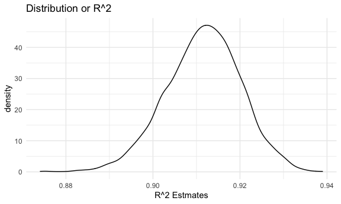

Linear models
================

### Problem 1

Loading data

``` r
homicide_df = 
  read_csv("data/homicide-data.csv", na = c("", "NA", "Unknown")) %>% 
  mutate(
    city_state = str_c(city, state, sep = ", "),
    victim_age = as.numeric(victim_age),
    resolution = case_when(
      disposition == "Closed without arrest" ~ 0,
      disposition == "Open/No arrest"        ~ 0,
      disposition == "Closed by arrest"      ~ 1)
  ) %>% 
  filter(
    victim_race %in% c("White", "Black"),
    city_state != "Tulsa, AL") %>% 
  select(city_state, resolution, victim_age, victim_race, victim_sex)
```

    ## 
    ## ── Column specification ────────────────────────────────────────────────────────
    ## cols(
    ##   uid = col_character(),
    ##   reported_date = col_double(),
    ##   victim_last = col_character(),
    ##   victim_first = col_character(),
    ##   victim_race = col_character(),
    ##   victim_age = col_double(),
    ##   victim_sex = col_character(),
    ##   city = col_character(),
    ##   state = col_character(),
    ##   lat = col_double(),
    ##   lon = col_double(),
    ##   disposition = col_character()
    ## )

Start with one city.

``` r
baltimore_df=
  homicide_df %>% 
  filter(city_state=="Baltimore, MD")

glm(resolution~victim_age+ victim_race + victim_sex, 
    data=baltimore_df,
    family=binomial()) %>% 
  broom::tidy() %>% 
  mutate(
    OR= exp(estimate),
    CI_lower=exp(estimate-1.96 * std.error),
    CI_upper=exp(estimate+1.96 * std.error)
  ) %>% 
  select(term, OR, starts_with("CI")) %>% 
  knitr::kable(digits=3)
```

| term              |    OR | CI\_lower | CI\_upper |
| :---------------- | ----: | --------: | --------: |
| (Intercept)       | 1.363 |     0.975 |     1.907 |
| victim\_age       | 0.993 |     0.987 |     1.000 |
| victim\_raceWhite | 2.320 |     1.648 |     3.268 |
| victim\_sexMale   | 0.426 |     0.325 |     0.558 |

Try across cities.

``` r
models_results_df = 
  homicide_df %>% 
  nest(data = -city_state) %>% 
  mutate(
    models = 
      map(.x = data, ~glm(resolution ~ victim_age + victim_race + victim_sex, data = .x, family = binomial())),
    results = map(models, broom::tidy)
  ) %>% 
  select(city_state, results) %>% 
  unnest(results) %>% 
  mutate(
    OR = exp(estimate),
    CI_lower = exp(estimate - 1.96 * std.error),
    CI_upper = exp(estimate + 1.96 * std.error)
  ) %>% 
  select(city_state, term, OR, starts_with("CI")) 
```

Male vs Female Homicide Resolutions

``` r
models_results_df %>% 
  filter(term=="victim_sexMale") %>% 
mutate(city_state=fct_reorder(city_state, OR)) %>% 
  ggplot(aes(x=city_state, y=OR))+
  geom_point()+
  geom_errorbar(aes(ymin=CI_lower, ymax=CI_upper))+
  theme(axis.text.x= element_text (angle=90, vjust=0.5, hjust=1))
```


### Problem 2

Load and clean the data for regression analysis (i.e. convert numeric to
factor where appropriate, check for missing data, etc.).

``` r
birth_weight_df = 
  read_csv("./data/birthweight.csv") %>%   
janitor::clean_names() %>% 
  mutate(
   race = as.factor(frace),
   race = recode(race,
    "1" = "White", 
    "2" = "Black", 
    "3" = "Asian", 
    "4" = "Puerto Rican", 
    "8" = "Other", 
    "9" = "Unknown"),
   mrace = as.factor(mrace),
   mrace = recode(mrace, 
    "1" = "White", 
    "2" = "Black", 
    "3" = "Asian", 
    "4" = "Puerto Rican", 
    "8" = "Other"),
   sex = as.factor(babysex),
   sex = recode(babysex, 
     "1" = "male", 
    "2" = "female"),
   malform = as.factor(malform),
   malform = recode(malform,
    "0" = "absent", 
    "1" = "present")) 
```

    ## 
    ## ── Column specification ────────────────────────────────────────────────────────
    ## cols(
    ##   .default = col_double()
    ## )
    ## ℹ Use `spec()` for the full column specifications.

I propose that `blength`, `delwt`, `bhead`,`parity`, `mrace`, `fincome`,
`smoken`, and `pnumlbw` would be in the model. I chose baby’s length at
birth, baby’s head circumference, mother’s weight at delivery, mother’s
number of live births before this pregnancy,average number of cigarettes
smoked per day during pregnancy,and previous number of low birth weight
babies since these variables are relevant to gestational and newborn
development. I chose race and family monthly income since they are
socioeconomic factors that could impact baby’s birthweight.

Baby’s Length

``` r
length_fit = lm(bwt ~ blength, data = birth_weight_df)
length_fit %>% 
  broom::tidy() %>% 
  select(term, estimate, p.value) %>% 
  knitr::kable(digits=3)
```

| term        |   estimate | p.value |
| :---------- | ---------: | ------: |
| (Intercept) | \-3841.267 |       0 |
| blength     |    139.811 |       0 |

Baby’s Head Circumference

``` r
head_fit = lm(bwt ~ bhead, data = birth_weight_df)
head_fit %>% 
  broom::tidy() %>% 
  select(term, estimate, p.value) %>% 
  knitr::kable(digits=3)
```

| term        |   estimate | p.value |
| :---------- | ---------: | ------: |
| (Intercept) | \-4830.866 |       0 |
| bhead       |    236.109 |       0 |

Mother’s Weight at Delivery

``` r
dlw_fit = lm(bwt ~ delwt, data = birth_weight_df)
dlw_fit %>% 
  broom::tidy() %>% 
  select(term, estimate, p.value) %>% 
  knitr::kable(digits=3)
```

| term        | estimate | p.value |
| :---------- | -------: | ------: |
| (Intercept) | 2147.912 |       0 |
| delwt       |    6.639 |       0 |

Mother’s Number of Live Births Before Pregnancy

``` r
parity_fit = lm(bwt ~ parity, data = birth_weight_df)
parity_fit %>% 
  broom::tidy() %>% 
  select(term, estimate, p.value) %>% 
  knitr::kable(digits=3)
```

| term        | estimate | p.value |
| :---------- | -------: | ------: |
| (Intercept) | 3114.500 |   0.000 |
| parity      | \-41.674 |   0.581 |

Average Number of Cigarettes Smoked per Day

``` r
smoke_fit = lm(bwt ~ smoken, data = birth_weight_df)
smoke_fit %>% 
  broom::tidy() %>% 
  select(term, estimate, p.value) %>% 
  knitr::kable(digits=3)
```

| term        | estimate | p.value |
| :---------- | -------: | ------: |
| (Intercept) | 3136.079 |       0 |
| smoken      |  \-5.229 |       0 |

Previous Number of Low Births Before Pregnancy

``` r
pnumlbw_fit = lm(bwt ~ pnumlbw, data = birth_weight_df)
head_fit %>% 
  broom::tidy() %>% 
  select(term, estimate, p.value) %>% 
  knitr::kable(digits=3)
```

| term        |   estimate | p.value |
| :---------- | ---------: | ------: |
| (Intercept) | \-4830.866 |       0 |
| bhead       |    236.109 |       0 |

Out of all of these linear models, the only non-significant one was
Mother’s Number of Live Births Before Pregnancy so I made a new model
with the significant variables so far.

``` r
together_fit=lm(bwt ~ bhead+ blength+ delwt + smoken, data=birth_weight_df) 

together_fit %>% 
  broom::tidy() %>% 
  select(term, estimate, p.value) %>% 
  knitr::kable(digits=3)
```

| term        |   estimate | p.value |
| :---------- | ---------: | ------: |
| (Intercept) | \-6063.929 |   0.000 |
| bhead       |    142.446 |   0.000 |
| blength     |     82.045 |   0.000 |
| delwt       |      2.136 |   0.000 |
| smoken      |    \-1.879 |   0.001 |

Now I added in the sociodemographic factors to see if they also were
related.

Mother Race

``` r
mrace_fit = lm(bwt ~ mrace, data = birth_weight_df)
mrace_fit %>% 
  broom::tidy() %>% 
  select(term, estimate, p.value) %>% 
  knitr::kable(digits=3)
```

| term              |  estimate | p.value |
| :---------------- | --------: | ------: |
| (Intercept)       |  3266.663 |   0.000 |
| mraceBlack        | \-316.564 |   0.000 |
| mraceAsian        | \-126.430 |   0.093 |
| mracePuerto Rican | \-211.321 |   0.000 |

Family Income

``` r
fincome_fit = lm(bwt ~ fincome, data = birth_weight_df)
fincome_fit %>% 
  broom::tidy() %>% 
  select(term, estimate, p.value) %>% 
  knitr::kable(digits=3)
```

| term        | estimate | p.value |
| :---------- | -------: | ------: |
| (Intercept) | 2979.987 |       0 |
| fincome     |    3.048 |       0 |

Both family income and race were also significant predictors in the
dataset so I added them to my final linear model.

``` r
final_fit=lm(bwt ~ bhead+ blength+ delwt + smoken+ mrace+fincome, data=birth_weight_df) 

final_fit %>% 
  broom::tidy() %>% 
  select(term, estimate, p.value) %>% 
  knitr::kable(digits=3)
```

| term              |   estimate | p.value |
| :---------------- | ---------: | ------: |
| (Intercept)       | \-5609.901 |   0.000 |
| bhead             |    135.436 |   0.000 |
| blength           |     78.484 |   0.000 |
| delwt             |      2.320 |   0.000 |
| smoken            |    \-4.621 |   0.000 |
| mraceBlack        |  \-147.152 |   0.000 |
| mraceAsian        |   \-69.382 |   0.106 |
| mracePuerto Rican |  \-118.246 |   0.000 |
| fincome           |      0.352 |   0.046 |

Plot of model residuals against fitted values

``` r
residuals_df = 
  birth_weight_df %>% 
  modelr::add_residuals(final_fit) %>% 
  modelr::add_predictions(final_fit) %>% 
  ggplot(aes(x = pred, y = resid)) +
  geom_point() +
  geom_smooth(se = FALSE) +
  labs(
    x = "Predicted birthweight", 
    y = "Residuals", 
    title = "Residuals Against Fitted Values")

residuals_df
```

    ## `geom_smooth()` using method = 'gam' and formula 'y ~ s(x, bs = "cs")'


Comments on my model:

It looks there is just a very large cluster of values that are between
2000 and 4000 that don’t follow a particular pattern. The linear
regression model that I made doesn’t seem to really follow the values
after around a predicted birthweight of around 2000 grams.

Compare your model to two others:

One using length at birth and gestational age as predictors (main
effects only)

``` r
fit_1 = lm(bwt ~ blength + gaweeks, data = birth_weight_df)
fit_1 %>% 
  broom::tidy() %>% 
  select(term, estimate, p.value) %>% 
  knitr::kable(digits = 3)
```

| term        |   estimate | p.value |
| :---------- | ---------: | ------: |
| (Intercept) | \-4347.667 |       0 |
| blength     |    128.556 |       0 |
| gaweeks     |     27.047 |       0 |

One using head circumference, length, sex, and all interactions
(including the three-way interaction) between these.

``` r
fit_2 = lm(bwt ~ bhead + blength + babysex + bhead*blength + bhead*babysex + blength*babysex + bhead*blength*babysex, data = birth_weight_df) 
      
fit_2 %>% 
  broom::tidy() %>% 
  select(term, estimate, p.value) %>% 
  knitr::kable(digits = 3)
```

| term                  |    estimate | p.value |
| :-------------------- | ----------: | ------: |
| (Intercept)           | \-13551.685 |    0.00 |
| bhead                 |     380.189 |    0.00 |
| blength               |     225.900 |    0.00 |
| babysex               |    6374.868 |    0.00 |
| bhead:blength         |     \-4.432 |    0.01 |
| bhead:babysex         |   \-198.393 |    0.00 |
| blength:babysex       |   \-123.773 |    0.00 |
| bhead:blength:babysex |       3.878 |    0.00 |

Make this comparison in terms of the cross-validated prediction error;
use crossv\_mc and functions in purrr as appropriate.

``` r
comparison_df = crossv_mc(birth_weight_df, 100)
comparison_results = comparison_df %>% 
  mutate(
    final_fit = map(train, ~lm(bwt ~ blength + gaweeks + mrace + fincome + smoken + blength*gaweeks, data = birth_weight_df)), 
    fit2 = map(train, ~lm(bwt ~ blength + gaweeks, data = birth_weight_df)),
    fit3 = map(train, ~lm(bwt ~ bhead + blength + babysex + bhead * blength + bhead * babysex + blength * babysex +  bhead * blength * babysex, data =birth_weight_df)),
    rmse_final_fit = map2_dbl(final_fit, test, ~rmse(model = .x, data = .y)), 
    rmse_main = map2_dbl(fit2, test, ~rmse(model = .x, data = .y)),
    rmse_interact = map2_dbl(fit3, test, ~rmse(model = .x, data = .y))
  )

comparison_results %>% 
  select(starts_with("rmse")) %>% 
  pivot_longer(
    everything(),
    names_to = "model", 
    values_to = "rmse",
    names_prefix = "rmse_") %>% 
  mutate(model = fct_inorder(model)) %>% 
  ggplot(aes(x = model, y = rmse)) + geom_violin()
```


Comparison of errors: The plot above indicates that the interact model
has the least RMSE and is probably the best fit model compared to the
linear model that I made as well as the main model suggested by Problem
2.

### Problem 3

``` r
weather_df = 
  rnoaa::meteo_pull_monitors(
    c("USW00094728"),
    var = c("PRCP", "TMIN", "TMAX"), 
    date_min = "2017-01-01",
    date_max = "2017-12-31") %>%
  mutate(
    name = recode(id, USW00094728 = "CentralPark_NY"),
    tmin = tmin / 10,
    tmax = tmax / 10) %>%
  select(name, id, everything())
```

    ## Registered S3 method overwritten by 'hoardr':
    ##   method           from
    ##   print.cache_info httr

    ## using cached file: /Users/akanksha/Library/Caches/R/noaa_ghcnd/USW00094728.dly

    ## date created (size, mb): 2020-10-04 08:12:57 (7.522)

    ## file min/max dates: 1869-01-01 / 2020-10-31

``` r
w_bootstrap = 
  weather_df %>% 
  modelr::bootstrap(n = 5000) %>% 
  mutate(
    models = map(strap, ~ lm(tmax ~ tmin, data = .x)),
    tidy_results = map(models, broom::tidy),  
    glance_results = map(models, broom::glance)) %>% 
  unnest(tidy_results, glance_results) %>% 
  select(.id, r.squared, estimate, term)
```

    ## Warning: unnest() has a new interface. See ?unnest for details.
    ## Try `df %>% unnest(c(tidy_results, glance_results))`, with `mutate()` if needed

``` r
w_bootstrap_2 = 
  w_bootstrap %>% 
  select(-.id) %>% 
  pivot_wider(
    names_from = term,
    values_from = estimate) %>% 
   rename(
    b0 = `(Intercept)`,
    b1 = tmin) %>% 
  mutate(log_results = log(b0*b1))
```

Plot the distribution of your estimates, and describe these in words. R
squared estimated

``` r
w_bootstrap_2 %>% 
  ggplot(aes(x = r.squared)) +
  geom_density() +
  labs(title = "Distribution or R^2",
       x = "R^2 Estmates")
```



``` r
w_bootstrap_2 %>% 
  ggplot(aes(x = log_results)) +
  geom_density() +
  labs(title = "Distribution of Log Estimates",
       x = "Log estimates")
```


``` r
quantile(pull(w_bootstrap_2, r.squared), probs = c(0.025, 0.975))
```

    ##      2.5%     97.5% 
    ## 0.8939856 0.9276292

``` r
quantile(pull(w_bootstrap_2, log_results), probs = c(0.025, 0.975))
```

    ##     2.5%    97.5% 
    ## 1.964063 2.059932

The 95% CI for r^2 is between 0.894 and 0.927 . The 95% CI for
log(b0\*b1) is between 1.965 and 2.060.
